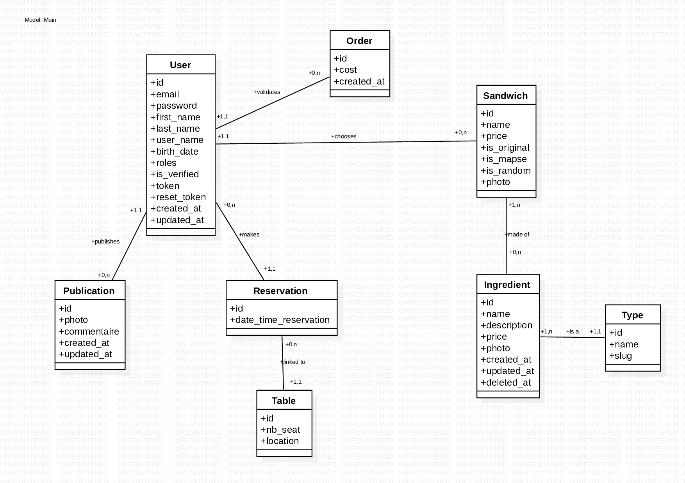

# Maps Ton Sandwich
An innovative website to create and share the sandwiches with the toppings you like!

> created by Samra Abdul, Pauline Auda, Amandine Brémont and Mathilde Turra


Features : 
- Registration and authentication system
- Mailer and reset password system
- Mapping system — ie. creating your own sandwich
- Cart system
- Payment system
- Publications and feed 
- Profile page
- Reservation system
- Admin back-end interface


## Class Diagram




## Languages

#### PHP
PHP is a server-side scripting language used for creating dynamic and web applications. We used it with Symfony, a framework used for building projects with a MVC architecture. 

#### Twig 
Twig is a flexible, and secure PHP template engine used by Symfony that simplifies the process of creating and maintaining HTML code.

#### Bootstrap & CSS
Bootstrap is an open-source CSS framework that provides a collection of pre-designed web components and tools. With a good configuration, we could override Bootstrap components with CSS files.

#### API
- API REST MailHog

MailHog is an email testing tool and API that allows to easily test and preview emails sent from web applications, without actually sending them to real email addresses.

- API Leaflet

Leaflet is an open-source JavaScript library and API for creating interactive maps.

- API Stripe

Stripe is a payment processing API that enables businesses to accept and manage online payments securely. We used the test version, that doesn't actually send any money.


## Settings

1. Clone or fork the MAPS repository on your local machine.
2. In the .env file, comment line 32 and uncomment line 31 : fill the app with your database name user, !ChangeMe! with your database password and app with your database name.
3. Install Mailhog : https://github.com/mailhog/MailHog/releases, run the .exe file and go to http://localhost:8025/ to access your inbox.
4. In your project directory terminal, run the following commands : 
```console
composer install
```
```console
composer require symfony/apache-pack
```
```console
composer require symfony/runtime
```
```console
composer require symfony/webpack-encore-bundle
```
```console
composer require stripe/stripe-php
```
```console
composer require beberlei/doctrineextensions=dev-master
```
```console
symfony console doctrine:database:create
```
```console
symfony console doctrine:migrations:migrate
```
```console
symfony console doctrine:fixtures:load
```
```console
npm install
```
```console
npm run build
```

5. Log in with one of the users below (or create yours!)
```console
Amandine (ADMIN) - email : amandine@admin.com, password : admin
Mathilde (ADMIN) - email : mathilde@admin.com, password : admin
Pauline (ADMIN) - email : pauline@admin.com, password : admin
Samra (ADMIN) - email : samra@admin.com, password : admin
Johnny (USER) - email : john@user.com, password : fabul0us
```

You're now free to enjoy our MAPS website!
